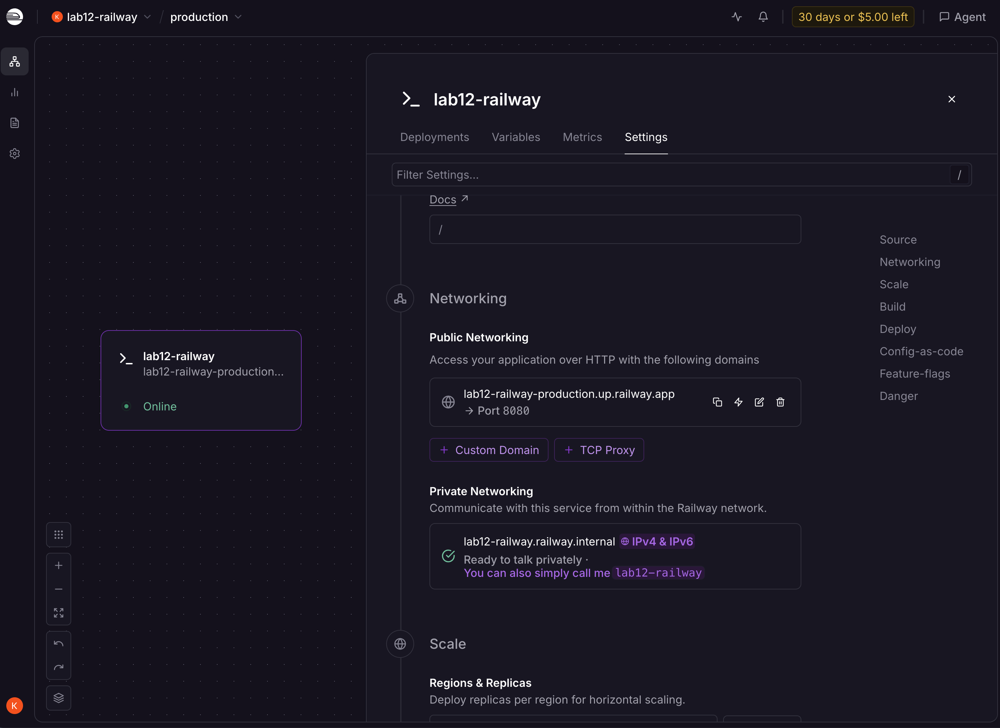
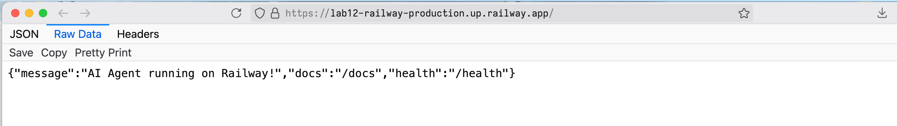
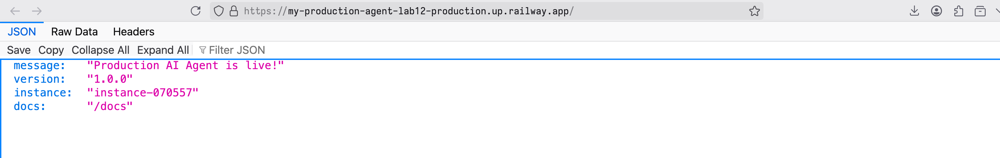
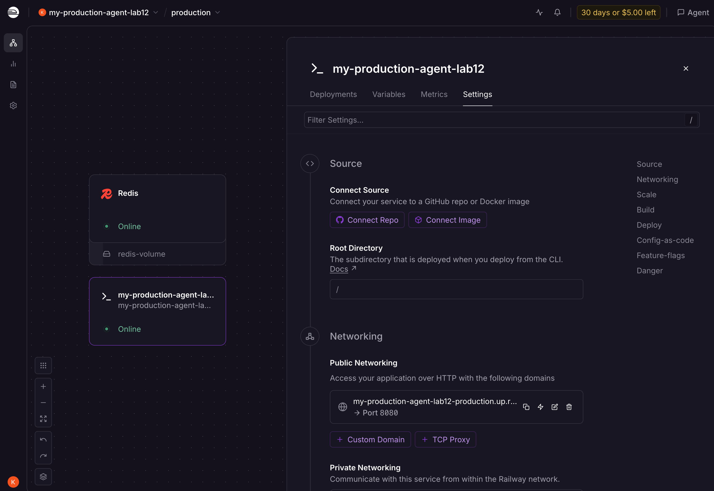

# Day 12 Lab - Mission Answers

## Part 1: Localhost vs Production

### Exercise 1.1: Anti-patterns found in `app.py`

1. API key hardcode trong code
2. Không có health check endpoint
3. Debug mode bật cứng
4. Không xử lý SIGTERM gracefully
5. Config không đến từ environment

### Exercise 1.2: Chạy basic version

Chạy được nhưng không production-ready.

### Exercise 1.3: Comparison table

| Feature | Develop | Production | Why Important? |
|---------|---------|------------|----------------|
| Config | Hardcode | Env vars | Bảo mật secrets (API key), dễ dàng thay đổi cấu hình giữa các môi trường mà không cần sửa code. |
| Health check | Không có | /health & /ready | Giúp orchestrator (Docker/Railway) biết app còn sống/sẵn sàng để tự động restart hoặc điều hướng traffic. |
| Logging | print() | JSON Structured | Tập trung log, dễ dàng tìm kiếm, lọc và giám sát hệ thống (monitoring/observability). |
| Shutdown | Đột ngột | Graceful | Hoàn thành các request đang xử lý dở, đóng kết nối an toàn, đảm bảo tính nhất quán của dữ liệu. |

## Part 2: Docker

### Exercise 2.1: Dockerfile questions

1. Base image:  `python3.11-slim`
2. Working directory: `/app`
3. Tại sao COPY requirements.txt trước? Để tận dụng Docker layer caching. Nếu dependencies không đổi, Docker không cần build lại layer này.
4. CMD vs ENTRYPOINT khác nhau thế nào? CMD là default command, có thể bị override bởi docker run. ENTRYPOINT là command chính, ít bị override hơn.

### Exercise 2.3: Image size comparison

- Stage 1 làm gì? Stage 1 là build stage, dùng để cài đặt các dependencies cần thiết cho việc build và test.
- Stage 2 làm gì? Stage 2 là production stage, dùng để build và run app. Nó chỉ copy các file cần thiết từ stage 1.
- Tại sao image nhỏ hơn? Stage 2 không chứa các dependencies không cần thiết cho việc run app, do đó image nhỏ hơn.
So sánh:
- Develop:  1.67GB  
- Production:  262MB
- Difference: down 84%

### Exercise 2.4: Docker Compose stack

Services nào được start?

1. `agent`: FastAPI AI agent (xử lý logic chính).
2. `redis`: Lưu trữ cache, session và phục vụ rate limiting.
3. `qdrant`: Vector database dùng cho RAG (Retrieval-Augmented Generation).
4. `nginx`: Đóng vai trò Reverse Proxy và Load Balancer, là cổng vào duy nhất từ bên ngoài.

Chúng communicate thế nào?

- Các service giao tiếp với nhau thông qua một mạng nội bộ ảo của Docker (mạng `internal`).
- `nginx` nhận traffic từ port 80/443 và điều hướng đến service `agent`.
- `agent` kết nối tới `redis` (qua hostname `redis`) và `qdrant` (qua hostname `qdrant`) để truy vấn dữ liệu.
- Các service sử dụng tên service làm hostname để tìm thấy nhau trong mạng nội bộ.

## Part 3: Cloud Deployment

### Exercise 3.1: Railway deployment

- URL: [https://lab12-railway-production.up.railway.app/](https://lab12-railway-production.up.railway.app/)
- Dashboard: 
- Health Check: 

## Part 4: API Security

### Exercise 4.1-4.3: Test results

**4.1: API Key Authentication**

- **Valid Key:**

```json
{"question":"hello","answer":"Agent đang hoạt động tốt! (mock response) Hỏi thêm câu hỏi đi nhé."}
```

- **Missing/Invalid Key:**

```json
{"detail":"Missing API key. Include header: X-API-Key: <your-key>"}
```

**4.2: JWT Authentication**

- **Token Response:**

```json
{"access_token":"eyJhbGciOiJIUzI1Ni...","token_type":"bearer","expires_in_minutes":60}
```

- **Authenticated Request:**

```json
{
  "question": "what is docker?",
  "answer": "Container là cách đóng gói app để chạy ở mọi nơi. Build once, run anywhere!",
  "usage": {
    "requests_remaining": 9,
    "budget_remaining_usd": 1.9e-05
  }
}
```

**4.3: Rate Limiting**

- **Output after 10 requests:**

```json
{"detail":"Rate limit exceeded. Maximum 10 requests per minute."}
```

*(Status Code: 429 Too Many Requests)*

### Exercise 4.4: Cost guard implementation

Hệ thống Cost Guard được thiết kế để kiểm soát chi phí sử dụng LLM API thông qua hai tầng bảo vệ chính:

1. **Cơ chế theo dõi (Usage Tracking):**
    - Sử dụng class `UsageRecord` để lưu trữ thông tin về `input_tokens`, `output_tokens`, và số lượng request theo từng `user_id` và từng ngày.
    - Giá tiền được quy định cụ thể cho mỗi 1k tokens (input: $0.00015, output: $0.0006) dựa trên model giả định (như GPT-4o-mini).

2. **Hai tầng Budget (Two-Level Enforcement):**
    - **Per-user Budget:** Giới hạn chi phí tối đa mỗi user được phép tiêu trong một ngày (mặc định $1.0). Nếu vượt quá, hệ thống trả về lỗi `402 Payment Required`.
    - **Global Budget:** Giới hạn tổng chi phí của toàn bộ hệ thống trong ngày (mặc định $10.0). Nếu hệ thống chạm ngưỡng này, nó sẽ trả về lỗi `503 Service Unavailable` và log lỗi mức độ `CRITICAL` để bảo vệ ví tiền của chủ sở hữu app.

3. **Quy trình hoạt động:**
    - **Trước khi gọi LLM:** Gọi `check_budget()` để kiểm tra xem user/hệ thống còn kinh phí không. Nếu chạm ngưỡng 80% (warn_at_pct), hệ thống sẽ log `WARNING` để quản trị viên theo dõi.
    - **Sau khi gọi LLM:** Gọi `record_usage()` để cập nhật chính xác số tokens đã sử dụng và cộng dồn chi phí vào record của user cũng như chi phí tổng.

4. **Tính mở rộng:** Mặc dù code demo đang lưu trong memory (`dict`), lớp này đã được thiết kế sẵn sàng để chuyển đổi sang sử dụng Redis hoặc Database cho môi trường production thực tế.

## Part 5: Scaling & Reliability

### Exercise 5.1-5.5: Implementation notes

#### 5.1: Health & Readiness Checks

- **Liveness Probe (`/health`):** Trả về trạng thái "sống" của container. Nếu ứng dụng bị treo hoặc hết bộ nhớ (`checks.memory` > 90%), nền tảng (như Docker/Kubernetes) sẽ tự động khởi động lại instance.
- **Readiness Probe (`/ready`):** Kiểm tra xem ứng dụng đã sẵn sàng xử lý request chưa (ví dụ: đã load xong model, đã kết nối thành công tới Redis). Load Balancer chỉ điều hướng traffic vào những instance trả về status 200 tại đây.

#### 5.2: Graceful Shutdown

- **Cơ chế:** Sử dụng `signal` để bắt tín hiệu `SIGTERM` từ orchestrator.
- **Xử lý:** Thông qua FastAPI `lifespan`, ứng dụng sẽ dừng nhận request mới, đợi cho các request đang xử lý (`in-flight requests`) hoàn thành trong khoảng thời gian chờ (grace period 30s) rồi mới chính thức tắt hẳn, tránh làm gián đoạn trải nghiệm của người dùng.

#### 5.3: Stateless Design

- **Vấn đề:** Trong thiết kế cũ (stateful), hội thoại được lưu trong RAM của từng instance. Nếu request sau rơi vào instance khác, agent sẽ "quên" ngữ cảnh.
- **Giải pháp:** Refactor toàn bộ logic lưu trữ sang **Redis**. Agent không giữ state trong memory, giúp bất kỳ instance nào cũng có thể truy cập và xử lý tiếp cuộc hội thoại dựa trên `session_id`.

#### 5.4: Load Balancing

- **Cấu hình:** Sử dụng **Nginx** làm Reverse Proxy với thiết lập `upstream` chia tải cho 3 replica của agent.
- **Quan sát:** Response trả về có thêm trường `served_by` cho thấy các request liên tiếp được xử lý bởi các `instance_id` khác nhau (ví dụ: `instance-a1b2`, `instance-c3d4`), chứng minh traffic đã được phân tán đều.

#### 5.5: Kiểm thử khả năng chịu lỗi (Stateless Test)

- **Kịch bản:** Bắt đầu hội thoại → Gửi nhiều request để kiểm tra load balancing → Xác minh history được bảo toàn giữa các instance.
- **Kết quả:** Hội thoại vẫn tiếp diễn mượt mà, không mất dữ liệu. Điều này khẳng định hệ thống có khả năng **horizontal scaling** (mở rộng theo chiều ngang) và độ tin cậy cao.

**Test Output:** `python test_stateless.py` return mock data upon calling `mock_llm.ask`

```text
============================================================
Stateless Scaling Demo
============================================================

Session ID: c29ccc5c-25fc-43fe-a14b-fe224be3f491

Request 1: [instance-9c238e]
  Q: What is Docker?
  A: Container là cách đóng gói app để chạy ở mọi nơi. Build once, run anywhere!...

Request 2: [instance-53684a]
  Q: Why do we need containers?
  A: Agent đang hoạt động tốt! (mock response) Hỏi thêm câu hỏi đi nhé....

Request 3: [instance-9ef098]
  Q: What is Kubernetes?
  A: Agent đang hoạt động tốt! (mock response) Hỏi thêm câu hỏi đi nhé....

Request 4: [instance-9c238e]
  Q: How does load balancing work?
  A: Agent đang hoạt động tốt! (mock response) Hỏi thêm câu hỏi đi nhé....

Request 5: [instance-53684a]
  Q: What is Redis used for?
  A: Tôi là AI agent được deploy lên cloud. Câu hỏi của bạn đã được nhận....

------------------------------------------------------------
Total requests: 5
Instances used: {'instance-9c238e', 'instance-53684a', 'instance-9ef098'}
✅ All requests served despite different instances!

--- Conversation History ---
Total messages: 10
  [user]: What is Docker?...
  [assistant]: Container là cách đóng gói app để chạy ở mọi nơi. Build once...
  [user]: Why do we need containers?...
  [assistant]: Agent đang hoạt động tốt! (mock response) Hỏi thêm câu hỏi đ...
  [user]: What is Kubernetes?...
  [assistant]: Agent đang hoạt động tốt! (mock response) Hỏi thêm câu hỏi đ...
  [user]: How does load balancing work?...
  [assistant]: Agent đang hoạt động tốt! (mock response) Hỏi thêm câu hỏi đ...
  [user]: What is Redis used for?...
  [assistant]: Tôi là AI agent được deploy lên cloud. Câu hỏi của bạn đã đư...

✅ Session history preserved across all instances via Redis!
```

---

## Part 6: Final Project

### Exercise 6.1: Production-ready Agent

Dự án cuối khóa kết hợp tất cả các kiến thức về Docker, Security, Scalability và Cloud Deployment. Files trong folder `my-production-agent`.

- **Public URL:** [https://my-production-agent-lab12-production.up.railway.app/](https://my-production-agent-lab12-production.up.railway.app/)
- **Xác nhận Deploy:** 
- **Xác nhận Redis & Ready:** 

**Hoàn thành:**

1. **Multi-stage Docker:** Giảm size image và tăng bảo mật.
2. **Security Pipeline:** API Key -> Rate Limit (Redis) -> Cost Guard.
3. **Stateless History:** Sử dụng Redis Lists để lưu trữ hội thoại một cách tin cậy.
4. **Reliability:** Health check, Readiness check và Graceful shutdown hoàn chỉnh.
